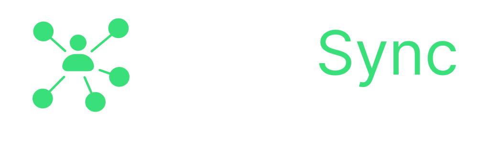

# CodeFlow

<div align="center">
  
  
  <p align="center">
    <strong>Real-time Collaborative Code Editor</strong>
  </p>
  
  <p align="center">
    Code together in real-time with your team. Share ideas, collaborate seamlessly, and build amazing projects together.
  </p>

  <p align="center">
    <a href="#features">Features</a> •
    <a href="#demo">Demo</a> •
    <a href="#tech-stack">Tech Stack</a> •
    <a href="#getting-started">Getting Started</a> •
    <a href="#usage">Usage</a> •
    <a href="#contributing">Contributing</a>
  </p>

  <p align="center">
    
    
    
    
    
  </p>
</div>

---

## ✨ Features

### 🚀 Real-time Collaboration
- **Instant Synchronization**: See changes as they happen with zero lag
- **Multi-cursor Support**: Track your team members' cursors in real-time
- **Live Presence**: Know who's online and actively editing

### 💬 Built-in Communication
- **Live Chat**: Communicate without leaving the editor
- **User Avatars**: Identify team members at a glance
- **Activity Indicators**: See who's typing and active

### 🎨 Drawing Board
- **Integrated Whiteboard**: Sketch ideas and create diagrams
- **Real-time Drawing Sync**: Collaborate on visual concepts
- **Export Capabilities**: Save your drawings

### 🤖 AI-Powered Assistant
- **Smart Code Suggestions**: Get intelligent completions powered by Google Gemini AI
- **Code Explanations**: Understand complex code with AI assistance
- **Refactoring Help**: Improve your code quality with AI recommendations

### 📝 Professional Code Editor
- **Monaco Editor**: The same editor that powers VS Code
- **Syntax Highlighting**: Support for 50+ programming languages
- **Auto-completion**: Intelligent code completion
- **Multiple Themes**: Choose from light and dark themes

### 🔧 Developer Friendly
- **No Sign-up Required**: Start coding instantly with a room ID
- **File Management**: Create, edit, and organize files and folders
- **Code Execution**: Run code directly in the browser (multiple languages)
- **Download Projects**: Export your entire workspace

---

## 🎬 Demo

> **Live Demo**: [Try CodeFlow Now](https://your-deployed-url.vercel.app)

### Screenshots

<div align="center">
  
  <p><em>Beautiful landing page with smooth animations</em></p>
  
  
  <p><em>Real-time collaborative code editor with live cursors</em></p>
  
  
  <p><em>Built-in chat for seamless team communication</em></p>
</div>

---

## 🛠️ Tech Stack

### Frontend
- **React 18** - UI library
- **TypeScript** - Type safety
- **Vite** - Build tool and dev server
- **Tailwind CSS** - Utility-first styling
- **Monaco Editor** - Code editor component
- **Socket.IO Client** - Real-time communication
- **React Router** - Client-side routing
- **Zustand/Context API** - State management

### Backend
- **Node.js** - Runtime environment
- **Express** - Web framework
- **Socket.IO** - WebSocket server
- **TypeScript** - Type safety

### AI Integration
- **Google Gemini AI** - AI-powered code assistance

### DevOps
- **Vercel** - Frontend deployment (recommended)
- **Docker** - Containerization (optional)
- **GitHub Actions** - CI/CD (optional)

---

## 🚀 Getting Started

### Prerequisites

Before you begin, ensure you have the following installed:
- **Node.js** (v18 or higher)
- **npm** or **yarn** or **pnpm**
- **Git**

### Installation

1. **Clone the repository**
   ```bash
   git clone https://github.com/Harjotraith04/LiveWire.git
   cd LiveWire
   ```

2. **Install dependencies**

   For the client:
   ```bash
   cd client
   npm install
   ```

   For the server:
   ```bash
   cd ../server
   npm install
   ```

3. **Set up environment variables**

   Create a `.env` file in the `server` directory:
   ```env
   PORT=3000
   GEMINI_API_KEY=your_gemini_api_key_here
   CLIENT_URL=http://localhost:5173
   ```

   Create a `.env` file in the `client` directory (if needed):
   ```env
   VITE_SERVER_URL=http://localhost:3000
   ```

4. **Start the development servers**

   Terminal 1 - Start the backend:
   ```bash
   cd server
   npm run dev
   ```

   Terminal 2 - Start the frontend:
   ```bash
   cd client
   npm run dev
   ```

5. **Open your browser**
   
   Navigate to `http://localhost:5173` to see the application running.

---

## 📖 Usage

### Creating a Room

1. Click **"Get Started Free"** on the landing page
2. Enter your username
3. Either:
   - **Create a new room**: A unique room ID will be generated
   - **Join existing room**: Enter a room ID shared by your team

### Collaborating

1. **Share the Room ID** with your team members
2. **Start coding** - changes sync in real-time
3. **Use the chat** to communicate
4. **Draw diagrams** using the integrated whiteboard
5. **Get AI help** for code suggestions and explanations

### Keyboard Shortcuts

- `Ctrl/Cmd + S` - Save file
- `Ctrl/Cmd + /` - Toggle comment
- `Ctrl/Cmd + F` - Find
- `Ctrl/Cmd + H` - Replace
- `F11` - Toggle fullscreen

---

## 📁 Project Structure

```
LiveWire/
├── client/                 # Frontend React application
│   ├── public/            # Static assets
│   ├── src/
│   │   ├── api/          # API utilities
│   │   ├── assets/       # Images, logos, etc.
│   │   ├── components/   # React components
│   │   ├── context/      # Context providers
│   │   ├── hooks/        # Custom React hooks
│   │   ├── pages/        # Page components
│   │   ├── styles/       # Global styles
│   │   ├── types/        # TypeScript types
│   │   └── utils/        # Utility functions
│   ├── package.json
│   └── vite.config.mts
│
├── server/                # Backend Node.js application
│   ├── src/
│   │   ├── types/        # TypeScript types
│   │   ├── ai-service.ts # AI integration
│   │   └── server.ts     # Main server file
│   ├── package.json
│   └── tsconfig.json
│
├── docs/                  # Documentation
└── README.md             # This file
```

---

## 🎨 Customization

### Themes

CodeFlow supports multiple themes. You can switch themes in the settings panel.

### Adding New Languages

To add support for new programming languages:

1. Update the language list in `client/src/utils/customMapping.ts`
2. Configure Monaco editor language support
3. Add execution support in the backend (if needed)

---

## 🧪 Testing

### Run Frontend Tests
```bash
cd client
npm run test
```

### Run Backend Tests
```bash
cd server
npm run test
```

---

## 📦 Building for Production

### Build the Frontend
```bash
cd client
npm run build
```

The built files will be in `client/dist/`

### Build the Backend
```bash
cd server
npm run build
```

The built files will be in `server/dist/`

---

## 🚀 Deployment

### Deploy Frontend (Vercel - Recommended)

1. Push your code to GitHub
2. Import project in [Vercel](https://vercel.com)
3. Set root directory to `client`
4. Deploy!

### Deploy Backend (Railway/Render/Heroku)

1. Choose your platform
2. Connect your GitHub repository
3. Set root directory to `server`
4. Add environment variables
5. Deploy!

### Docker Deployment

```bash
# Build and run with Docker Compose
docker-compose up -d
```

---

## 🤝 Contributing

Contributions are what make the open-source community such an amazing place to learn, inspire, and create. Any contributions you make are **greatly appreciated**.

### How to Contribute

1. **Fork the Project**
2. **Create your Feature Branch**
   ```bash
   git checkout -b feature/AmazingFeature
   ```
3. **Commit your Changes**
   ```bash
   git commit -m 'Add some AmazingFeature'
   ```
4. **Push to the Branch**
   ```bash
   git push origin feature/AmazingFeature
   ```
5. **Open a Pull Request**

### Development Guidelines

- Follow the existing code style
- Write meaningful commit messages
- Add tests for new features
- Update documentation as needed
- Ensure all tests pass before submitting PR

---

## 🐛 Bug Reports

If you find a bug, please create an issue with:
- Clear title and description
- Steps to reproduce
- Expected vs actual behavior
- Screenshots (if applicable)
- Your environment details

---

## 💡 Feature Requests

Have an idea for a new feature? We'd love to hear it!
- Open an issue with the `enhancement` label
- Describe the feature and its benefits
- Provide examples or mockups if possible

---

## 📄 License

This project is licensed under the MIT License - see the [LICENSE](LICENSE) file for details.

---

## 👥 Authors

- **Harjot Singh** - [Harjotraith04](https://github.com/Harjotraith04)

---

## 🙏 Acknowledgments

- [Monaco Editor](https://microsoft.github.io/monaco-editor/) - The code editor
- [Socket.IO](https://socket.io/) - Real-time engine
- [Google Gemini AI](https://deepmind.google/technologies/gemini/) - AI capabilities
- [Tailwind CSS](https://tailwindcss.com/) - Styling framework
- [React](https://react.dev/) - UI library
- [Vite](https://vitejs.dev/) - Build tool

---

## 📞 Contact

- **GitHub**: [@Harjotraith04](https://github.com/Harjotraith04)
- **Project Link**: [https://github.com/Harjotraith04/LiveWire](https://github.com/Harjotraith04/LiveWire)

---

## ⭐ Show Your Support

If you like this project, please consider giving it a ⭐ on GitHub!

---

<div align="center">
  <p>Made with ❤️ by developers, for developers</p>
  <p>© 2025 CodeFlow. All rights reserved.</p>
</div>
